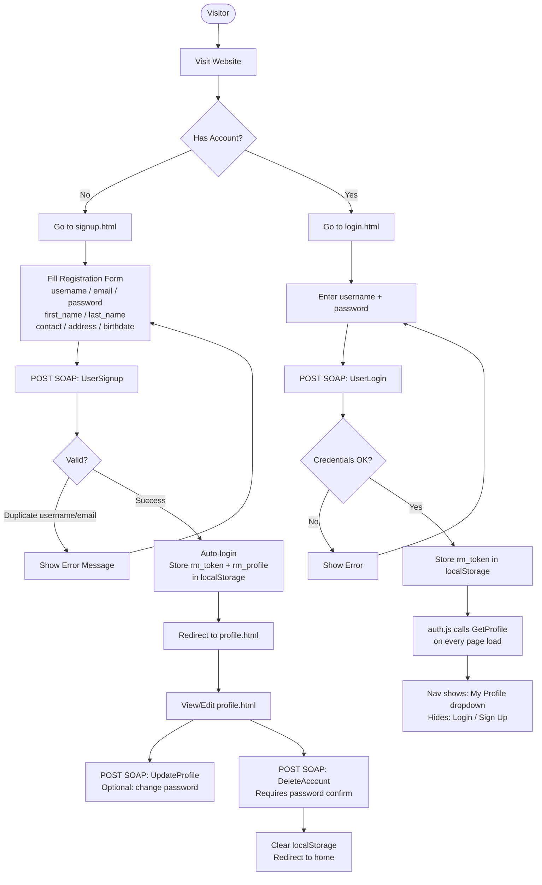
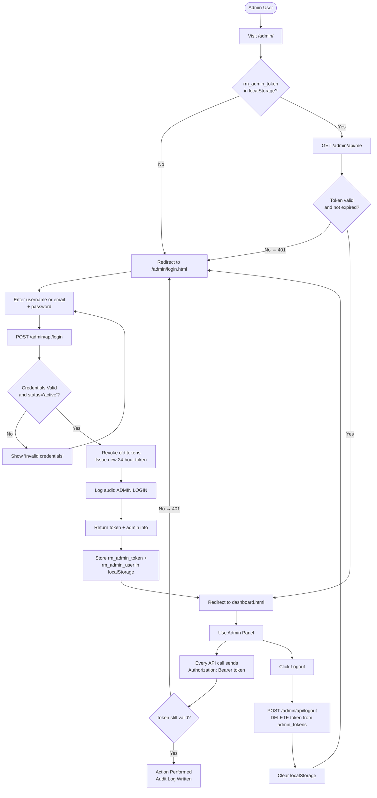
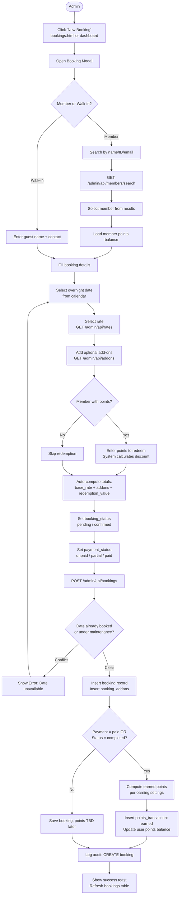
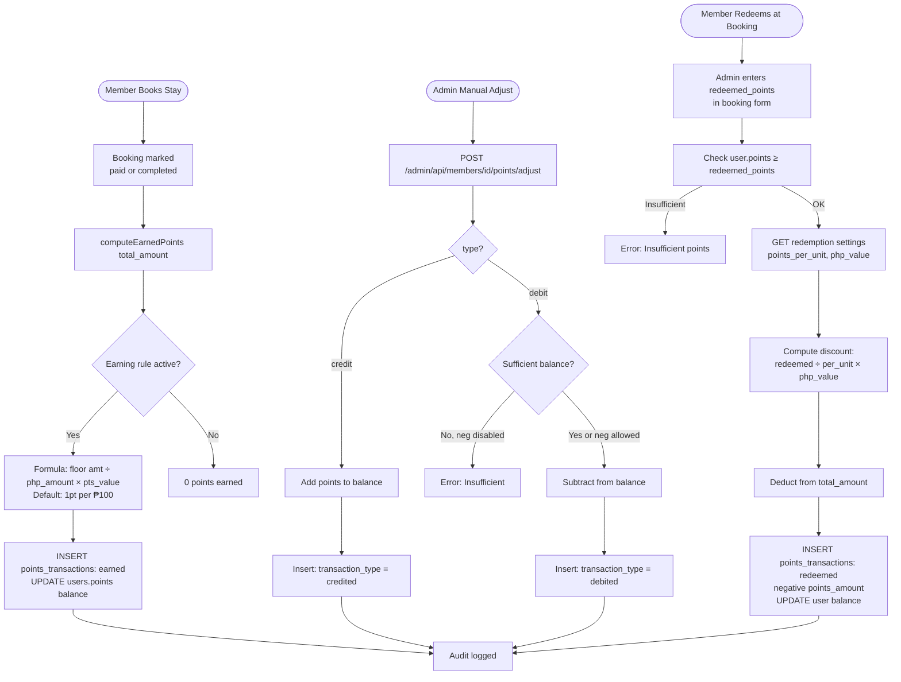
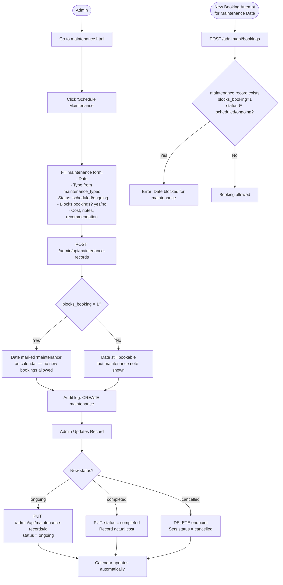
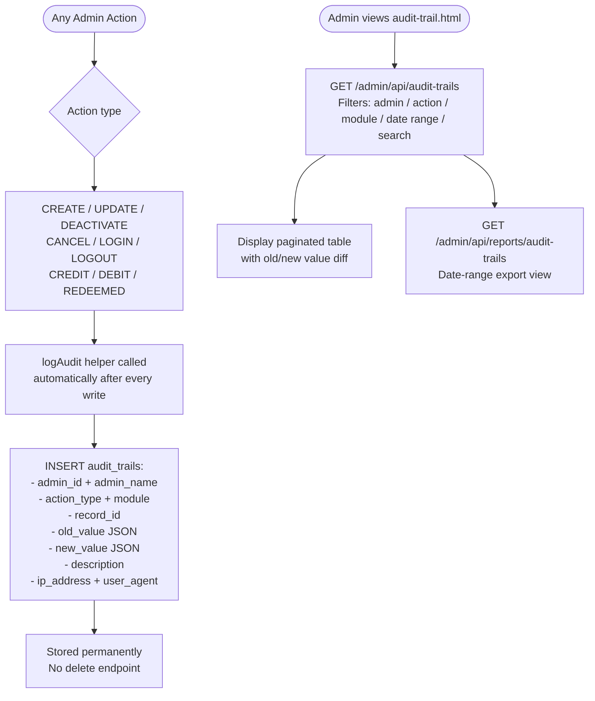

# RM Private Pool — Project Process Map & Activity Diagrams

> Generated: 2026-06-16  
> Project: RM Private Pool (Lubao, Pampanga)  
> Stack: Bootstrap 5 HTML · PHP SOAP API (Frontend) · PHP REST API/Leaf (Admin)

---

## 1. Project Architecture Overview

```
public_html/
├── index.html, amenities_inclusions.html, rates_bookings.html   ← Public site pages
├── events.html, contact.html
├── login.html, signup.html, profile.html                        ← Member auth pages
├── assets/js/auth.js                                            ← SOAP client helper
├── api/                                                         ← SOAP API (Member auth)
│   ├── index.php                                                ← SOAP handler
│   ├── soap/SoapHandler.php, WsdlGenerator.php
│   ├── services/AuthService.php
│   └── config/database.php
└── admin/                                                       ← ADMIN PANEL (separated)
    ├── login.html                                               ← Admin login gate
    ├── dashboard.html, members.html, bookings.html ...
    ├── admin.js, admin.css, layout.js
    └── api/                                                     ← REST API (Admin)
        └── index.php                                            ← Leaf PHP router
```

### Two Separate Systems

| Layer | Public Site | Admin Panel |
|---|---|---|
| URL | `/` | `/admin/` |
| API type | SOAP (`/api/`) | REST JSON (`/admin/api/`) |
| Auth token | `localStorage.rm_token` | `localStorage.rm_admin_token` |
| Auth table | `user_tokens` | `admin_tokens` (24 hr expiry) |
| Users | `users` table | `admin_users` table |
| Roles | Member only | superadmin / admin / staff |

---

## 2. Admin Panel — Separation Details

The admin panel lives at `/admin/` and is already isolated from the public site:

- **Separate login page** — `admin/login.html` with its own session (no relation to member login)
- **Separate token storage** — `rm_admin_token` vs public `rm_token`
- **Separate API** — `/admin/api/index.php` (Leaf REST) vs `/api/index.php` (SOAP)
- **Separate DB tables** — `admin_users`, `admin_tokens`, `audit_trails`
- **Directory listing disabled** — `.htaccess` has `Options -Indexes`
- **Cache busting** — JS/CSS served with `no-cache` headers

### Admin Pages Map

| Page | Route | Function |
|---|---|---|
| Login | `/admin/login.html` | Admin authentication gate |
| Dashboard | `/admin/dashboard.html` | Stats, charts, mini calendar, quick actions |
| Members | `/admin/members.html` | View/Add/Edit/Deactivate members |
| Points | `/admin/points.html` | Points transactions ledger |
| Points Settings | `/admin/points-earning.html` | Earning & redemption rules |
| Reservations | `/admin/bookings.html` | Create/manage bookings |
| Calendar | `/admin/calendar.html` | Availability calendar view |
| Rates | `/admin/rates.html` | Manage pricing rates |
| Add-ons | `/admin/addons.html` | Manage add-on services |
| Maintenance | `/admin/maintenance.html` | Schedule/track maintenance |
| Admin Users | `/admin/admins.html` | Manage admin accounts |
| Reports | `/admin/reports.html` | Revenue, bookings, points reports |
| Audit Trail | `/admin/audit-trail.html` | Full admin action log |
| Settings | `/admin/settings.html` | System-wide configuration |

---

## 3. Activity Diagram — Member Registration & Login (Public Site)



---

## 4. Activity Diagram — Admin Authentication



---

## 5. Activity Diagram — Booking Creation Process



---

## 6. Activity Diagram — Points Lifecycle



---

## 7. Activity Diagram — Maintenance Scheduling



---

## 8. Activity Diagram — Audit Trail Flow



---

## 9. Database Schema — Entity Relationships

```
users ──────────────────────────────────────────────────────┐
│ id, membership_id, username, email, password               │
│ first_name, last_name, contact_number, address, birthdate  │
│ points, status, remarks, created_at                        │
└──┬──────────────────────────────────────────────────────── │
   │ 1:N                                                      │
   ▼                                                          │
bookings ──────────────────────────────────────────────────  │
│ id, user_id (FK→users), guest_name, guest_contact          │
│ overnight_date (UNIQUE), checkin_datetime, checkout_datetime│
│ rate_id (FK→rates), base_rate, addons_total, subtotal      │
│ redeemed_points, redeemed_points_value, total_amount       │
│ earned_points                                              │
│ booking_status: pending|confirmed|completed|cancelled       │
│ payment_status: unpaid|partial|paid|refunded               │
│ created_by (FK→admin_users)                                │
└──┬──────────────┬───────────────────────────────────────── │
   │ 1:N           │ 1:N                                      │
   ▼               ▼                                          │
booking_addons    points_transactions ─────────────────────── │
│ booking_id      │ user_id (FK→users)                       │
│ addon_id        │ booking_id (FK→bookings, nullable)        │
│ addon_name      │ transaction_type:                         │
│ quantity        │   earned|redeemed|credited|debited        │
│ unit_price      │ points_amount (negative = debit)          │
│ total_price     │ previous_balance, new_balance             │
└─────────────    │ performed_by (FK→admin_users)            │
                  └───────────────────────────────────────── │

rates                        addons
│ id, rate_name, amount      │ id, addon_name, price
│ rate_type:                 │ status, created_by
│   weekday|weekend|holiday  └──────────────────────
│   promo|custom
│ effective_date, status
└──────────────────────────

admin_users ──────────────────────────────────────────────────
│ id, username, email, full_name, password                    │
│ role: superadmin|admin|staff                                │
│ status: active|inactive                                     │
└──┬───────────────────────────────────────────────────────── │
   │ 1:N                                                       │
   ▼                                                           │
admin_tokens                  audit_trails                     │
│ admin_id (FK)               │ admin_id (FK→admin_users)     │
│ token (64-char hex)         │ action_type, module           │
│ expires_at (+24h)           │ record_id, old_value,new_value│
└──────────────              │ ip_address, user_agent         │
                             └───────────────────────────────  │

maintenance_types ──────────────────────────────────────────── │
│ id, type_name, description, status                           │
└──┬───────────────────────────────────────────────────────── │
   │ 1:N                                                       │
   ▼                                                           │
maintenance_records                                            │
│ maintenance_date, maintenance_type_id                        │
│ status: scheduled|ongoing|completed|cancelled                │
│ blocks_booking (TINYINT)                                     │
│ cost, notes, recommendation                                  │
└──────────────────────────────────────────────────────────── │

points_earning_settings      points_redemption_settings
│ php_amount, points_value   │ points_per_unit, php_value
│ Default: ₱100 → 1pt        │ Default: 1pt → ₱1.00
└──────────────────          └──────────────────────────

system_settings              membership_sequence
│ setting_key / value        │ Auto-increment counter
│ setting_group              │ for membership_id (e.g. RM-0001)
└──────────────              └───────────────────────────
```

---

## 10. REST API Endpoint Reference (Admin)

| Method | Endpoint | Action |
|---|---|---|
| POST | `/login` | Admin login → token |
| POST | `/logout` | Revoke token |
| GET | `/me` | Get current admin info |
| GET | `/admins` | List admin users |
| POST | `/admins` | Create admin user |
| GET/PUT/DELETE | `/admins/{id}` | Get / Update / Deactivate admin |
| GET | `/users` | List members |
| POST | `/users` | Create member |
| GET/PUT/DELETE | `/users/{id}` | Get / Update / Deactivate member |
| GET | `/members/search` | Search members (typeahead) |
| GET | `/users/{id}/points` | Get member points balance |
| POST | `/members/{id}/points/adjust` | Credit or debit points |
| POST | `/points/credit` | Manual credit points |
| POST | `/points/debit` | Manual debit points |
| GET | `/points/transactions` | List points ledger |
| GET/POST | `/points/settings` | Get / Update earning+redemption rules |
| PUT | `/points/settings/{id}` | Update specific rule |
| GET | `/rates` | List rates |
| POST | `/rates` | Create rate |
| GET/PUT/DELETE | `/rates/{id}` | Get / Update / Deactivate rate |
| GET | `/addons` | List add-ons |
| POST | `/addons` | Create add-on |
| GET/PUT/DELETE | `/addons/{id}` | Get / Update / Deactivate add-on |
| GET | `/bookings` | List bookings (filterable) |
| POST | `/bookings` | Create booking |
| GET/PUT/DELETE | `/bookings/{id}` | Get / Update / Cancel booking |
| GET | `/calendar/availability` | Month calendar with booking+maintenance status |
| GET | `/maintenance-types` | List maintenance categories |
| POST | `/maintenance-types` | Create category |
| GET/PUT/DELETE | `/maintenance-types/{id}` | Get / Update / Deactivate |
| GET | `/maintenance-records` | List maintenance records |
| POST | `/maintenance-records` | Schedule maintenance |
| GET/PUT/DELETE | `/maintenance-records/{id}` | Get / Update / Cancel record |
| GET | `/audit-trails` | Query audit log |
| GET | `/dashboard/stats` | Dashboard aggregate stats |
| GET | `/reports/bookings` | Booking report (date range) |
| GET | `/reports/revenue` | Monthly revenue summary |
| GET | `/reports/maintenance` | Maintenance cost report |
| GET | `/reports/points` | Points transactions report |
| GET | `/reports/points-earned` | Earned points report |
| GET | `/reports/points-redeemed` | Redeemed points report |
| GET | `/reports/audit-trails` | Audit log export |
| GET/POST | `/settings` | Get / Save system settings |

---

## 11. SOAP API Reference (Public / Member)

| Operation | Auth Required | Action |
|---|---|---|
| `UserLogin` | No | username + password → token |
| `UserSignup` | No | Register new member → auto-login |
| `GetProfile` | Bearer token in SOAP header | Fetch logged-in member data |
| `UpdateProfile` | Bearer token | Update fields (optional: new_password + current_password) |
| `DeleteAccount` | Bearer token | Delete own account (requires password) |

---

## 12. Key Business Rules

1. **One booking per overnight date** — `UNIQUE KEY uq_overnight_date` on `bookings.overnight_date`
2. **Maintenance blocks bookings** — when `blocks_booking=1` and status is `scheduled` or `ongoing`, new bookings on that date are rejected
3. **Points earning** — triggered automatically when booking becomes `completed` or `paid`; formula: `floor(total ÷ php_amount) × points_value`
4. **Points redemption** — deducted at booking creation; formula: `(pts ÷ points_per_unit) × php_value` = peso discount
5. **Soft deletes** — no hard deletes anywhere; records are set to `inactive` or `cancelled`
6. **Audit everything** — every admin write operation logs to `audit_trails` with old/new JSON values, IP, and user agent
7. **Token expiry** — admin tokens expire after 24 hours; frontend member tokens use their own expiry mechanism
8. **Membership IDs** — auto-assigned sequential IDs via `membership_sequence` table
